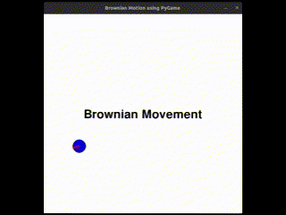

# Brownian Movement Simulation using PyGame

A simple visualization of Brownian motion using `pygame`, where a dot continuously moves and bounces inside a box with random variations in its velocity to simulate particle behavior.

## Demo

<p align="center">
  
</p>

> The above gif shows a blue dot representing a particle undergoing Brownian motion, with a red arrow indicating its current direction of movement.

## Features

- Simulates random motion similar to Brownian dynamics
- Blue circle (particle) moves and changes direction upon hitting boundaries
- Red arrow shows current direction vector of movement
- Centered title text for visualization

## Getting Started

### Prerequisites

Make sure you have Python and `pygame` installed:

```bash
pip install pygame numpy
```

## Running the Simulation

Clone the repository and run the script:
```bash
python brownian.py
```

## Folder Structure
```bash
.
├── brownian.py       # Main simulation code
├── demo.gif          # GIF showing a sample run
└── README.md         # This file
```
